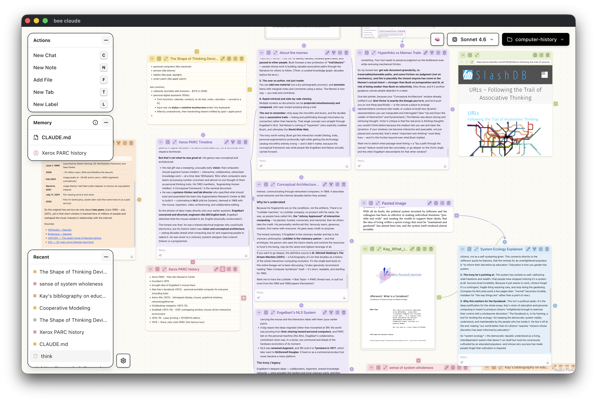

# bee-claude

A canvas UI for chatting, taking notes, and reading PDFs/webpages



## Setup

```bash
npm install --legacy-peer-deps
npm run dev
```

The app should open automatically as a Mac app.

Optionally, run `claude setup-token` to authenticate with your Claude subscription, then copy and paste the token into the app's settings (button in the lower left). Otherwise, you'll need an API key.

## About

- A frontend for the Claude Agent SDK
- Rooted in your filesystem
- Can specify MCPs
- See several chats side by side
- Fork chats
- Take notes in markdown
- Read PDFs/webpages in split view or full screen
- Transform PDFs/webpages into notes
- Connect any resource node to a chat as context
- Built-in index memory system
